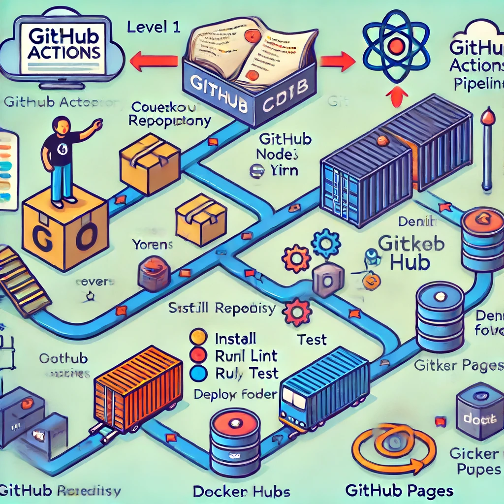

# OpenScience

## Description

**OpenScience** is a scientific journalism project dedicated to disseminating recent research and discoveries. We use modern technologies to ensure an exceptional user experience and optimal performance.

## Technologies Used

### Astro

- **Description**: Astro is a modern framework for building fast and dynamic websites. It uses a component-based architecture and allows the integration of multiple technologies.
- **Documentation**: [Astro Docs](https://docs.astro.build/)

### React

- **Description**: React is a JavaScript library for building user interfaces. It allows creating reusable components and managing the application state efficiently.
- **Documentation**: [React Docs](https://reactjs.org/docs/getting-started.html)

### ESLint

- **Description**: ESLint is a tool for identifying and reporting on patterns found in JavaScript code, with the goal of making the code more consistent and avoiding bugs.
- **Configuration for Astro**: We have configured ESLint to work specifically with Astro, ensuring that the code adheres to the project's standards and best practices.
- **Documentation**: [ESLint Docs](https://eslint.org/docs/user-guide/getting-started)

### Stylelint

- **Description**: Stylelint is a tool for analyzing and fixing CSS code, helping maintain consistent styles and avoiding common errors.
- **Documentation**: [Stylelint Docs](https://stylelint.io/)

### Node.js

- **Description**: Node.js is a JavaScript runtime built on Chrome's V8 JavaScript engine, allowing the execution of JavaScript code on the server.
- **Version**: 18.19
- **Documentation**: [Node.js Docs](https://nodejs.org/en/docs/)

### Prettier

- **Description**: Prettier is a code formatter that ensures consistent style throughout the codebase, regardless of who writes the code.
- **Documentation**: [Prettier Docs](https://prettier.io/docs/en/index.html)
- **Fixing Issues**: If there are any issues with Prettier, use the command:
  ```sh
  yarn prettier:fix
  ```

### Husky

- \*\*Description: Husky is a tool for managing Git hooks, allowing the execution of scripts at specific points in the Git workflow.
- \*\*Documentation: [Husky Docs](https://typicode.github.io/husky/)

### Storybook

- **Description**: Storybook is a tool for developing and documenting UI components in isolation, allowing for the independent building and testing of components.
- **Documentation**: [Storybook Docs](https://storybook.js.org/docs/react/get-started/introduction)

### Vite

- **Description**: Vite is a fast development environment for modern web projects, offering a quick build time and agile development experience.
- **Documentation**: [Vite Docs](https://vitejs.dev/guide/)

### Vitest

- **Description**: Vitest is a testing framework that works seamlessly with Vite, providing a fast and efficient testing experience.
- **Documentation**: [Vitest Docs](https://vitest.dev/)

### Playwright

- **Description**: Playwright is a browser automation tool that enables end-to-end testing with a powerful and flexible API.
- **Documentation**: [Playwright Docs](https://playwright.dev/docs/intro)

- ## Installation and Usage

**Clone the repository**:

```sh
git clone https://github.com/your-username/openscience.git
cd openscience
```

### Install dependencies

```sh
yarn install
```

### Start the development environment:

```sh
yarn dev
```

### Github actions pipeline

```
+---------------+       +---------------+
|  Developer    |       |  GitHub       |
|  (person)    +------->  Actions      |
|               |       |  (platform) |
+---------------+       +-------+-------+
                                    |
                                    v
                            +-------+-------+
                            |  Docker Hub   |
                            |  (registry)   |
                            +---------------+
                                    |
                                    v
                            +-------+-------+
                            |  GitHub Pages |
                            |  (service)   |
                            +---------------+
```

### Containers level 2

```
+----------------------------+
|   GitHub Actions           |
|   (Pipeline)               |
|                            |
|   +--------------------+   |
|   |   Build Job        |   |
|   |                    |   |
|   | 1. Checkout repo   |   |
|   | 2. Setup Node.js   |   |
|   | 3. Install Yarn    |   |
|   | 4. Install deps    |   |
|   | 5. Run lint        |   |
|   | 6. Run test        |   |
|   | 7. Build Storybook |   |
|   | 8. Deploy Storybook|   |
|   | 9. Clean folder    |   |
|   | 10. Login Docker   |   |
|   | 11. Setup env vars |   |
|   | 12. Get commit hash|   |
|   | 13. Build project  |   |
|   | 14. Build Docker   |   |
|   | 15. Push Docker    |   |
|   | 16. Remove image   |   |
|   +--------------------+   |
+----------------------------+

```

### Pipeline


