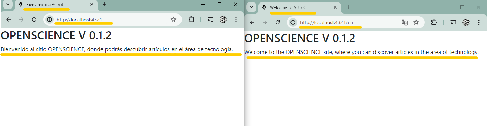
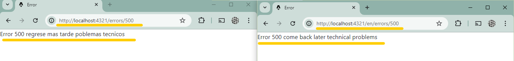
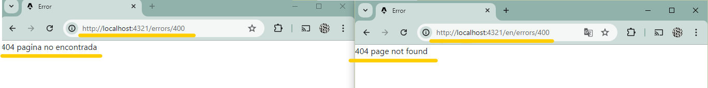
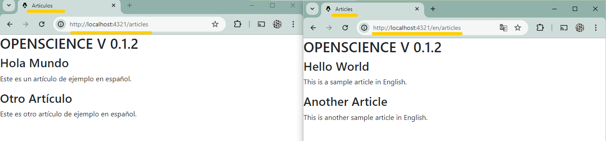

# Integración de Astro con i18next para soporte de multilenguaje
---
## ¿Qué es i18next?
i18next proporciona un marco para gestionar traducciones de manera eficiente y organizada. Con i18next, puedes gestionar y aplicar traducciones en tu aplicación, siendo responsable de proporcionar las traducciones para cada cadena de texto que desees traducir. 

---
Para integrar i18next en nuestro proyecto, utilizaremos la siguiente documentación:  
[i18next](https://github.com/yassinedoghri/astro-i18next#readme)

1. #### Instalación
Para instalar, ejecutamos el siguiente comando: 
`yarn add astro-i18next`  

2. #### Configuración
En el archivo astro.config.mjs, importamos astroI18next y lo añadimos a las integraciones: 
    `import astroI18next from "astro-i18next";`  
```
    export default defineConfig({
        integrations: [astroI18next()],
    });
```
3. #### Configuración de Multilenguaje
Creamos `astro-i18next.config.mjs` con la configuración básica:
```
/** @type {import('astro-i18next').AstroI18nextConfig} */
export default {
  defaultLocale: "es",
  locales: ["es", "en"],
};
```
Donde:

- defaultLocale: Define el idioma por defecto del sitio.
- locales: Define los idiomas disponibles.

4. #### Creación de archivos de traducción  
En la carpeta public/locales, creamos una carpeta por cada idioma con un archivo `translation.json`.
```
  public
  └── locales
      ├── es
      |   └── translation.json
      ├── en
      |   └── translation.json
```
5. #### Configuración de archivos de traducción
En `translation.json`, definimos las claves y textos traducidos para cada idioma.
```
// public/locales/en/translation.json
{
  "page": {
    "title": "Welcome to Astro!",
    "description": "Welcome to the OPENSCIENCE site, where you can discover articles in the area of technology."
  }
}
```
Este archivo se realizara para cada idioma.

6. #### Implementación de traducciones en la pagina

En `index.astro`:
```
---
//Importamos la función 't' de i18next para traducción
import { t } from "i18next";
import Layout from "../layouts/Layout.astro";

---
//Mostramos la descripción de la página obtenida desde el archivo de traducción
//"page" es la clave y "title" es el campo
<Layout title={t("page.title")}>
  <h1>OPENSCIENCE V 0.1.2</h1>
  <p>{t("page.description")}</p>
</Layout>

<style></style>
```
7. #### Generación de Páginas
Utilizamos el comando para generar archivos de configuración necesarios y ajustes específicos para Astro:
`yarn astro-i18next generate`
 
 Una vez utilizado el comando tendremos nuestro sitio en español (idioma por defecto) y en ingles (/en)
 

Realizamos el mismo procedimiento para las paginas de error.



 ---

8. #### Pruebas Adicionales
i18next ofrece funciones como namespace para organizar y estructurar traducciones dentro de la aplicación. Por ejemplo, para el namespace articles:

- De ese modo crearemos el namespace de articles
```
// En el archivo astro-i18next.config.mjs
export default {
   .
    namespaces: ["articles"],
};
```
- Creamos un archivo `articles.json` con traducciones específicas.
```
{
    "page": {
        "title": "Articles"
    },
    "article": [
        {
            "id": 1,
            "title": "Hello World",
            "content": "This is a sample article in English."
        },
        {
            "id": 2,
            "title": "Another Article",
            "content": "This is another sample article in English."
        }
    ]
}
```
- Ahora cremos una carpeta `articles` y dentro de esta carpeta un `index.astro`
```
  src
  └── pages  
      ├── articles
      |   └── index.astro
```
- En este index implementamos el siguiente codigo:
```
---
import { t, setDefaultNamespace } from "i18next";
import Layout from "../../layouts/Layout.astro";

//Establecemos el namespace predeterminado para las traducciones de artículos
setDefaultNamespace("articles");

//Definimos un arreglo de objetos que contienen las claves de título y contenido de los artículos
const articles = [
    {
        id: 1,
        titleKey: "article.0.title",
        contentKey: "article.0.content"
    },
    {
        id: 2,
        titleKey: "article.1.title",
        contentKey: "article.1.content"
    }
];
---

<Layout title={t("page.title")}>
  <h1>OPENSCIENCE V 0.1.2</h1>
  <div>
    {articles.map(article => (
      <div>
      // Mostramos el título del artículo traducido con las claves y campos definidos anteriormente
        <h2>{t(article.titleKey)}</h2>
        <p>{t(article.contentKey)}</p>
      </div>
    ))}
  </div>
</Layout>
```
- De ese modo tendremos los articulos mockeados traducidos


---
En la documentación de [i18next](https://github.com/yassinedoghri/astro-i18next#readme) encontraremos diferentes funcionalidades que nos permitiran manejar las traducciones o aplicaciones de nuestra página.
Algunos ejemplos:
`<Trans>`: Esta es una componente de React que permite realizar traducciones de manera directa en elementos JSX, proporcionando una sintaxis clara y directa para la internacionalización dentro de aplicaciones React.
`Interpolation`: Se refiere al proceso de insertar dinámicamente valores dentro de cadenas de texto traducidas. i18next soporta varias formas de interpolación, permitiendo que las traducciones contengan variables o expresiones que se resuelven dinámicamente durante la ejecución de la aplicación.